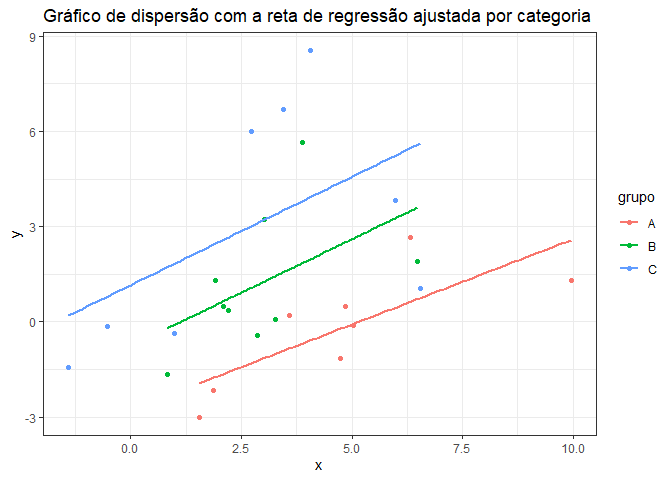
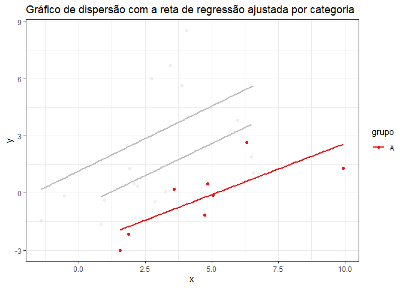

# API_Regressao_Linear

Esta API foi desenvolvida por Eric Pavarin Lima, João Victor Siqueira
Rodrigues, Lara Maria Herrera Drugowick e Rodrigo Caldiron, como parte
das atividades realizadas na disciplina de ME918-2S-2024 (Produto de
Dados) do curso de Estatística da UNICAMP.

## Introdução

`API_Regressao_Linear` é uma interface que permite ao usuário interagir
com um banco de dados, por meio de manipulações de adição, modificação e
remoção de observações. Também possibilita ao usuário a utilização de um
modelo de regressão linear que traz as estimativas dos parâmetros do
modelo, suas significâncias estatísticas, predições para novos dados e
gráficos de dispersão relacionados tanto à reta de regressão ajustada,
quanto aos resíduos.

Ela foi criada e desenvolvida a partir do pacote `plumber` do R (e
testada através do `Swagger`) que, define uma estrutura de API a partir
de rotas, facilitando a implementação e a verificação com testes para
validar o comportamento das mesmas.

## Uso

Para exemplificação, considere o seguinte banco de dados simulado com
cinco observações:

    ##          x grupo        y    momento_registro ID
    ## 1 5.354514     B 6.433922 2024-10-23 21:53:37  1
    ## 2 6.308610     A 8.873692 2024-10-23 21:53:37  2
    ## 3 6.739688     B 9.642285 2024-10-23 21:53:37  3
    ## 4 3.741000     C 7.266051 2024-10-23 21:53:37  4
    ## 5 3.720005     A 3.661662 2024-10-23 21:53:37  5

onde

- `x`: variável preditora de natureza númerica.
- `grupo`:variável preditora categórica.
- `y`:variável resposta.
- `momento_registro`: horário em que a observação foi gerada.
- `ID`: identificador responsável pela exclusividade da observação.

## Rotas

### Dados

`/data/add_row`: Rota responsável por adicionar uma nova observação por
requisição, recebendo os seguintes argumentos:

- `x`
- `grupo`
- `y`

Para exemplificar, considere a seguinte requisição
`/data/add_row?x=5&grupo=A&y=10` (`x = 10`, `grupo = A`, `y = 10`).

    ##          x grupo         y    momento_registro ID
    ## 1 5.354514     B  6.433922 2024-10-23 21:53:37  1
    ## 2 6.308610     A  8.873692 2024-10-23 21:53:37  2
    ## 3 6.739688     B  9.642285 2024-10-23 21:53:37  3
    ## 4 3.741000     C  7.266051 2024-10-23 21:53:37  4
    ## 5 3.720005     A  3.661662 2024-10-23 21:53:37  5
    ## 6 5.000000     A 10.000000 2024-10-23 21:53:37  6

Além disso, mais duas rotas foram adicionadas para garantir melhor
manutenção dos dados, já que estar limitado apenas à inserção de novas
variáveis pode gerar problemas, como a impossibolidade de correção para
a adição de uma informação errada.

`/data/delete_row`: Rota que exclui observações de três maneiras
diferentes, recebendo como argumento o `ID`. A primeira forma é feita
excluindo uma única observação. Suponha que deseja-se excluir o
`ID = 1`, então, a requisição é `/data/delete_row?ID=1`.

    ##          x grupo         y    momento_registro ID
    ## 2 6.308610     A  8.873692 2024-10-23 21:53:37  2
    ## 3 6.739688     B  9.642285 2024-10-23 21:53:37  3
    ## 4 3.741000     C  7.266051 2024-10-23 21:53:37  4
    ## 5 3.720005     A  3.661662 2024-10-23 21:53:37  5
    ## 6 5.000000     A 10.000000 2024-10-23 21:53:37  6

Em certos casos, é preferível excluir uma sequência de observações, isso
pode ser feito por meio da sequência `1:3` (isto é, as observações de 1
à 3 estão sendo excluídas), cuja requisição é dada por
`/data/delete_row?ID=1%3A4`.

    ##          x grupo         y    momento_registro ID
    ## 4 3.741000     C  7.266051 2024-10-23 21:53:37  4
    ## 5 3.720005     A  3.661662 2024-10-23 21:53:37  5
    ## 6 5.000000     A 10.000000 2024-10-23 21:53:37  6

Por fim, a terceira maneira é utilizando vetores como `1, 3, 5`, com a
requisição dada por `/data/delete_row?ID=1%2C3%2C5`.

    ##          x grupo         y    momento_registro ID
    ## 1 5.354514     B  6.433922 2024-10-23 21:53:37  1
    ## 3 6.739688     B  9.642285 2024-10-23 21:53:37  3
    ## 5 3.720005     A  3.661662 2024-10-23 21:53:37  5
    ## 6 5.000000     A 10.000000 2024-10-23 21:53:37  6

`/data/change_row`: Rota que modifica uma única observação por
requisição. Para isso, é necessário especificar os argumentos:

- `ID`
- `x`
- `y`
- `grupo`

Se o interesse é alterar a observação de `ID = 5` para `x = 5`,
`grupo = C` e `y = 15`, tem-se que a requisição é
`/data/change_row?ID=5&x=5&grupo=C&y=15`.

    ##          x grupo         y    momento_registro ID
    ## 1 5.354514     B  6.433922 2024-10-23 21:53:37  1
    ## 2 6.308610     A  8.873692 2024-10-23 21:53:37  2
    ## 3 6.739688     B  9.642285 2024-10-23 21:53:37  3
    ## 4 3.741000     C  7.266051 2024-10-23 21:53:37  4
    ## 5 5.000000     C 15.000000 2024-10-23 21:53:37  5
    ## 6 5.000000     A 10.000000 2024-10-23 21:53:37  6

### Inferência

Considere que foi necessário adicionar mais observações no banco de
dados para a análise inferêncial.

`/fit/param`: Rota que fornece as estimativas dos parâmetros da
regressão, e.g. `/fit/param`.

    ## {
    ##   "beta_0": [-3.1872],
    ##   "beta_1": [0.6248],
    ##   "beta_2": [2.5642],
    ##   "beta_3": [4.4997],
    ##   "QME": [5.2567]
    ## }

`/fit/residuals`: Rota que retorna todos os resíduos da regressão. Nesse
exemplo é exibido apenas os seis primeiros, com requisição dada por
`/fit/residuals`.

    ## [-1.5131,-1.2313,-1.3551,-0.9376,-1.8813,-1.5385]

`/fit/p_values`: Rota que informa sobre a significância estatística dos
parâmetros, e.g. `/fit/p_values`.

    ## {
    ##   "beta_0": [-3.1872],
    ##   "beta_1": [0.6248],
    ##   "beta_2": [2.5642],
    ##   "beta_3": [4.4997],
    ##   "QME": [5.2567]
    ## }

`/fit/pred`: Rota que realiza predições para novas observações.
Especificando na requisição `x = 10` e `grupo = B`,
e.g. `/fit/pred?x=10&grupo=B`.

    ## [11.874]

Além disso, essa rota pode retornar mais de uma predição, caso a
requisição seja `/fit/pred?x=10%2C20&grupo=B%2CA`, isto é, `x = 10, 20`
e `grupo = B, A`.

    ## [11.874,3.0613]

### Gráficos

Considere que foi necessário adicionar mais observações ao banco de
dados para a análise gráfica da regressão.

`/plot/lm`: Rota responsável por gerar o gráfico de dispersão juntamente
com a reta de regressão ajustada. Há um argumento opcional `focus` que
destaca o grupo desejado. Caso não seja passado nenhum argumento, a
chamada é `/plot/lm`.

<!-- -->

Supondo que queremos focar no grupo `A` a chamada é `/plot/lm?focus=A`.
Além disso, mais de um grupo pode ser especificado utilizando a vírgula
para separá-los.

<!-- -->

`/plot/residuals`: Rota que realiza a requisição do gráfico de resíduos
da regressão contra os valores preditos. A sua chamada é dada por
`/plot/residuals`.

<!-- -->

`/plot/residuals_qq`: Rota que realiza a requisição do gráfico QQ-plot.
Sua chamada é dada por `/plot/residuals_qq`.

``` r
db_grafico %>% ggplot(aes(sample = residuals(modelo_simulado))) +
  stat_qq(col="blue", size=2, alpha=0.6) +
  stat_qq_line(col="red", size=1) +
  labs(title = "QQ-Plot", x = "Quantis Teóricos", y = "Quantis Amostrais") +
  theme_bw()
```

    ## Warning: Using `size` aesthetic for lines was deprecated in ggplot2 3.4.0.
    ## ℹ Please use `linewidth` instead.
    ## This warning is displayed once every 8 hours.
    ## Call `lifecycle::last_lifecycle_warnings()` to see where this warning was
    ## generated.

<!-- -->
